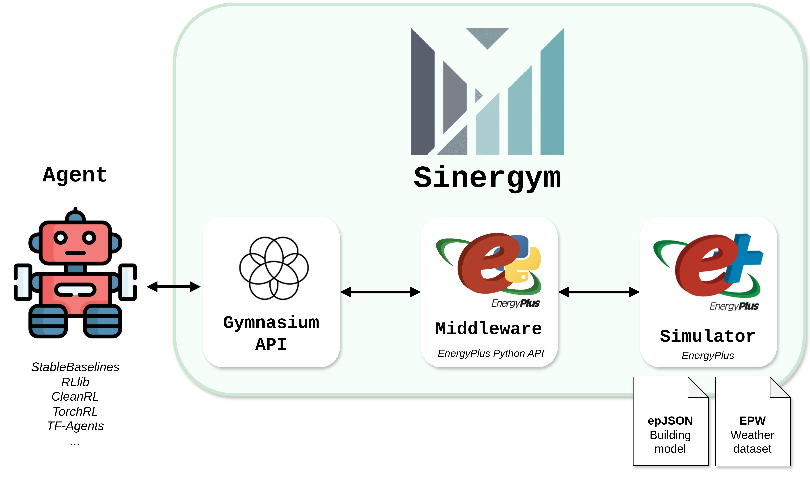

# Sinergym

<div align="center">
  <br><br>
</div>

</p>
  <p align="center">
    <a href="https://github.com/ugr-sail/sinergym/releases">
      
    </a>
    <a href="https://github.com/ugr-sail/sinergym/commits/main">
      
    </a>
    <a href="https://pypi.org/project/sinergym/">
      
    </a>
    <a href="https://github.com/ugr-sail/sinergym/stargazers">
      
    </a>
    <a href="https://codecov.io/gh/ugr-sail/sinergym">
      
    </a>
    <a href="https://github.com/ugr-sail/sinergym/graphs/contributors">
      
    </a>
    <a href="https://github.com/ugr-sail/sinergym/issues">
      
    </a>
    <a href="https://github.com/ugr-sail/sinergym/pulls">
      
    </a>
    <a href="https://github.com/ugr-sail/sinergym/blob/main/LICENSE">
      
    </a>
    <a href="https://www.python.org/downloads/release/python-3120/">
      
    </a>
    <br />
    <br />
    <a href="https://code.visualstudio.com/">
      
    </a>
  </p>

**Welcome to Sinergym!**

<div align="center">
  <br><br>
</div>

:warning: **Warning:** Pytype is disabled temporally because is not compatible with Python 3.12 yet.

The goal of this project is to create an environment following *Gymnasium* interface for wrapping 
simulation engines (*EnergyPlus*) for building control using **deep reinforcement learning** 
or any external control.

For more information about Sinergym, please visit our [documentation](https://ugr-sail.github.io/sinergym/compilation/main/index.html).

To report questions and issues, please use our [issue tracker](https://github.com/ugr-sail/sinergym/issues). We appreciate your feedback and contributions. Check out our [CONTRIBUTING.md](https://github.com/ugr-sail/sinergym/blob/main/CONTRIBUTING.md) for more details on how to contribute.

The main functionalities of *Sinergym* are the following:

- **Simulation Engine Compatibility**: Uses [EnergyPlus Python API](https://energyplus.readthedocs.io/en/latest/api.html) for Python-EnergyPlus communication. Future plans include more engines like [OpenModelica](https://openmodelica.org/).

- **Benchmark Environments**: Designs environments for benchmarking and testing deep RL algorithms or other external strategies, similar to *Atari* or *Mujoco*.

- **Customizable Environments**: Allows easy modification of experimental settings. Users can create their own environments or modify pre-configured ones in *Sinergym*.

- **Customizable Components**: Enables creation of new custom components for new environments, making *Sinergym* scalable, such as function rewards, wrappers, controllers, etc.

- **Automatic Building Model Adaptation**: *Sinergym* automates the process of adapting the building model to user changes in the environment definition.

- **Automatic Actuators Control**: Controls actuators through the Gymnasium interface based on user specification, only actuators names are required and *Sinergym* will do the rest.

- **Extensive Environment Information**: Provides comprehensive information about *Sinergym* background components from the environment interface.

- **Stable Baseline 3 Integration**: Customizes functionalities for easy testing of environments with SB3 algorithms, such as callbacks and customizable training real-time logging. However, *Sinergym* is agnostic to any DRL algorithm.

- **Google Cloud Integration**: Offers guidance on using *Sinergym* with Google Cloud infrastructure.

- **Weights & Biases Compatibility**: Automates and facilitates training, reproducibility, and comparison of agents in simulation-based building control problems. [WandB](https://wandb.ai/site) assists in managing and monitoring model lifecycle.

- **Notebook Examples**: Provides code in notebook format for user familiarity with the tool.

- **Extensive Documentation, Unit Tests, and GitHub Actions Workflows**: Ensures *Sinergym* is an efficient ecosystem for understanding and development.

- And much more!

_This is a project in active development. Stay tuned for upcoming releases._

<div align="center">
  <br><br>
</div>

## Project Structure

This repository is organized into the following directories:

- `sinergym/`: Contains the source code for *Sinergym*, including the environment, modeling, simulator, and tools such as wrappers and reward functions.
- `docs/`: Online documentation generated with Sphinx and using Restructured Text (RST).
- `examples/`: Jupyter notebooks illustrating use cases with Sinergym.
- `tests/`: Unit tests for Sinergym to ensure stability.
- `scripts/`: Scripts for various tasks such as agent training and performance checks, allowing configuration using JSON format.

## Available Environments

For a complete and up-to-date list of available environments, please refer to [our documentation](https://ugr-sail.github.io/sinergym/compilation/main/pages/environments.html#).

## Installation

Please visit [INSTALL.md](https://github.com/ugr-sail/sinergym/blob/main/INSTALL.md) for detailed installation instructions.

## Usage example


If you used our Dockerfile during installation, you should have the *try_env.py* file in your workspace as soon as you enter in. In case you have installed everything on your local machine directly, place it inside our cloned repository. In any case, we start from the point that you have at your disposal a terminal with the appropriate python version and *Sinergym* running correctly.

*Sinergym* uses the standard Gymnasium API. So a basic loop should look like:

```python

import gymnasium as gym
import sinergym
# Create the environment
env = gym.make('Eplus-datacenter-mixed-continuous-stochastic-v1')
# Initialize the episode
obs, info = env.reset()
truncated = terminated = False
R = 0.0
while not (terminated or truncated):
    a = env.action_space.sample() # random action selection
    obs, reward, terminated, truncated, info = env.step(a) # get new observation and reward
    R += reward
print('Total reward for the episode: %.4f' % R)
env.close()
```

A folder will be created in the working directory after creating the environment. It will contain the Sinergym outputs produced during the simulation.

For more examples and details, please visit our [usage examples](https://ugr-sail.github.io/sinergym/compilation/main/pages/notebooks/basic_example.html#Basic-example) documentation section.


## Google Cloud Platform support

For more information about this functionality, please, visit our documentation [here](https://ugr-sail.github.io/sinergym/compilation/main/pages/gcloudAPI.html#sinergym-with-google-cloud).

## Projects using Sinergym

The following are some of the projects benefiting from the advantages of Sinergym:

- [Demosthen/ActiveRL](https://github.com/Demosthen/ActiveRL)
- [VectorInstitute/HV-Ai-C](https://github.com/VectorInstitute/HV-Ai-C)
- [rdnfn/beobench](https://github.com/rdnfn/beobench)

:pencil: If you want to appear in this list, do not hesitate to send us a PR and include the following badge in your repository:

<p align="center">
  <a href="https://github.com/ugr-sail/sinergym">
      
  </a>
</p>

## Repo Activity


## Citing Sinergym

If you use *Sinergym* in your work, please cite our [paper](https://dl.acm.org/doi/abs/10.1145/3486611.3488729):

```bibtex
@inproceedings{2021sinergym,
    title={Sinergym: A Building Simulation and Control Framework for Training Reinforcement Learning Agents}, 
    author={Jiménez-Raboso, Javier and Campoy-Nieves, Alejandro and Manjavacas-Lucas, Antonio and Gómez-Romero, Juan and Molina-Solana, Miguel},
    year={2021},
    isbn = {9781450391146},
    publisher = {Association for Computing Machinery},
    address = {New York, NY, USA},
    url = {https://doi.org/10.1145/3486611.3488729},
    doi = {10.1145/3486611.3488729},
    booktitle = {Proceedings of the 8th ACM International Conference on Systems for Energy-Efficient Buildings, Cities, and Transportation},
    pages = {319–323},
    numpages = {5},
}
```
