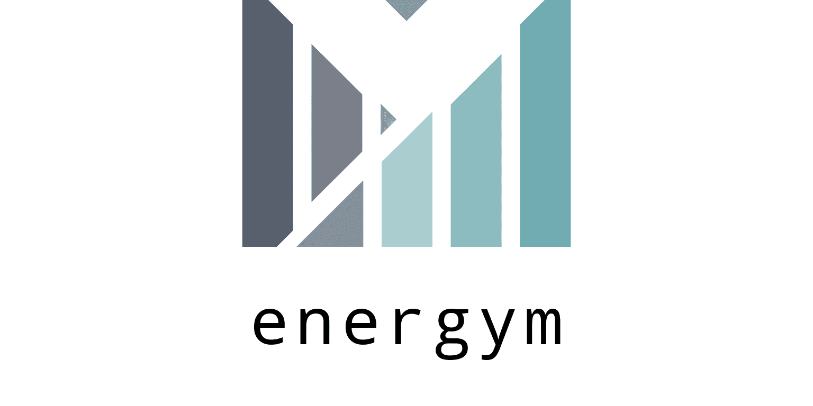

# sinergym

<div align="center">
  <br><br>
</div>

**Welcome to sinergym!**

This is a project based on Zhiang Zhang and Khee Poh Lam [Gym-Eplus](https://github.com/zhangzhizza/Gym-Eplus).

The goal of this project is to create an environment following OpenAI Gym interface for wrapping simulation engines for building control using **deep reinforcement learning**.

The main functionalities of Sinergym are the following :

  - **Benchmark environments**. Similarly to Atari or Mujoco environments for RL community, we are designing a set of environments for benchmarking and testing deep RL algorithms. These environments may include different buildings, weathers or action/observation spaces.
  - **Develop different experimental settings**. We aim to provide a package that allows to modify experimental settings in an easy manner. For example, several reward functions or observation variables may be defined. 
  - **Include different simulation engines**. Communication between Python and [EnergyPlus](https://energyplus.net/) is established using [BCVTB](https://simulationresearch.lbl.gov/bcvtb/FrontPage). Since this tool allows for interacting with several simulation engines, more of them (e.g. [OpenModelica](https://openmodelica.org/)) could be included in the backend while maintaining the Gym API.
  -  **Building Models configuration automatically**: Building models will be
   adapted to specification of each simulation. For example, *Designdays* and 
   *Location* from IDF files will be adapted to weather file specified in
   Sinergym simulator backend without any intervention by the user.
  -  **Extra configuration facilities**: Our team aim to provide extra parameters
   in order to amplify the context space for the experiments with this tool.
   Sinergym will modify building model automatically based on parameters set.
   For example: People occupant, timesteps per simulation hour, observation
   and action spaces, etc.
  -  **Stable Baseline 3 Integration**. Some functionalities like callbacks
   have been developed by our team in order to test easily these environments
   with deep reinforcement learning algorithms.
  -  **Google Cloud Integration**. Whether you have a Google Cloud account and you want to
   use your infrastructure with Sinergym, we tell you some details about how doing it.
  - **Mlflow tracking server**. [Mlflow](https://mlflow.org/) is an open source platform for the machine
   learning lifecycle. This can be used with Google Cloud remote server (if you have Google Cloud account) 
   or using local store. This will help you to manage and store your runs and artifacts generated in an orderly
   manner.
  -  **Data Visualization**. Using Sinergym logger or Tensorboard server to visualize training information
   in real-time.
  - Many more!

_This is a work in progress project. Stay tuned for upcoming releases._

<div align="center">
  <br><br>
</div>

[## List of available environments]::

[| Env. name                                  | Location        | IDF file                | Weather type (*)           | Action space | Simulation period |]::
[|--------------------------------------------|-----------------|-------------------------|----------------------------|--------------|-------------------|]::
[| Eplus-demo-v1                              | Pittsburgh, USA | 5ZoneAutoDXVAV.idf      |             -              | Discrete(10) |   01/01 - 31/03   |]::
[| Eplus-5Zone-hot-discrete-v1                | Arizona, USA    | 5ZoneAutoDXVAV.idf      |        Hot dry (2B)        | Discrete(10) |   01/01 - 31/12   |]::
[| Eplus-5Zone-mixed-discrete-v1              | New York, USA   | 5ZoneAutoDXVAV.idf      |      Mixed humid (4A)      | Discrete(10) |   01/01 - 31/12   |]::
[| Eplus-5Zone-cool-discrete-v1               | Washington, USA | 5ZoneAutoDXVAV.idf      |      Cool marine (5C)      | Discrete(10) |   01/01 - 31/12   |]::
[| Eplus-5Zone-hot-continuous-v1              | Arizona, USA    | 5ZoneAutoDXVAV.idf      |        Hot dry (2B)        | Box(2)       |   01/01 - 31/12   |]::
[| Eplus-5Zone-mixed-continuous-v1            | New York, USA   | 5ZoneAutoDXVAV.idf      |      Mixed humid (4A)      | Box(2)       |   01/01 - 31/12   |]::
[| Eplus-5Zone-cool-continuous-v1             | Washington, USA | 5ZoneAutoDXVAV.idf      |      Cool marine (5C)      | Box(2)       |   01/01 - 31/12   |]::
[| Eplus-5Zone-hot-discrete-stochastic-v1     | Arizona, USA    | 5ZoneAutoDXVAV.idf      |        Hot dry (2B)(**)    | Discrete(10) |   01/01 - 31/12   |]::
[| Eplus-5Zone-mixed-discrete-stochastic-v1   | New York, USA   | 5ZoneAutoDXVAV.idf      |      Mixed humid (4A)(**)  | Discrete(10) |   01/01 - 31/12   |]::
[| Eplus-5Zone-cool-discrete-stochastic-v1    | Washington, USA | 5ZoneAutoDXVAV.idf      |      Cool marine (5C)(**)  | Discrete(10) |   01/01 - 31/12   |]::
[| Eplus-5Zone-hot-continuous-stochastic-v1   | Arizona, USA    | 5ZoneAutoDXVAV.idf      |        Hot dry (2B)(**)    | Box(2)       |   01/01 - 31/12   |]::
[| Eplus-5Zone-mixed-continuous-stochastic-v1 | New York, USA   | 5ZoneAutoDXVAV.idf      |      Mixed humid (4A)(**)  | Box(2)       |   01/01 - 31/12   |]::
[| Eplus-5Zone-cool-continuous-stochastic-v1  | Washington, USA | 5ZoneAutoDXVAV.idf      |      Cool marine (5C)(**)  | Box(2)       |   01/01 - 31/12   |]::
[| Eplus-datacenter-discrete-v1               | Chicago, USA    | 2ZoneDataCenterHVAC.idf |             -              | Discrete(10) |   01/01 - 31/12   |]::
[| Eplus-datacenter-continuous-v1             | Chicago, USA    | 2ZoneDataCenterHVAC.idf |             -              | Box(4)       |   01/01 - 31/12   |]::
[| Eplus-datacenter-discrete-stochastic-v1    | Chicago, USA    | 2ZoneDataCenterHVAC.idf |            (**)            | Discrete(10) |   01/01 - 31/12   |]::
[| Eplus-datacenter-continuous-stochastic-v1  | Chicago, USA    | 2ZoneDataCenterHVAC.idf |            (**)            | Box(4)       |   01/01 - 31/12   |]::
[| Eplus-IWMullion-discrete-v1                | Pittsburgh, USA | IWMullion.idf           |             -              | Discrete(10) |   01/01 - 31/03   |]::
[| Eplus-IWMullion-continuous-v1              | Pittsburgh, USA | IWMullion.idf           |             -              | Box(2)       |   01/01 - 31/03   |]::
[| Eplus-IWMullion-discrete-stochastic-v1     | Pittsburgh, USA | IWMullion.idf           |            (**)            | Discrete(10) |   01/01 - 31/03   |]::
[| Eplus-IWMullion-continuous-stochastic-v1   | Pittsburgh, USA | IWMullion.idf           |            (**)            | Box(2)       |   01/01 - 31/03   |]::

[(*) Weather types according to (DOE's classification)(https://www.energycodes.gov/development/commercial/prototype_models#TMY3).]::

[(**) In these environments, weather series change from episode to episode. Gaussian noise with 0 mean and 2.5 std is added to the original values in order to add stochasticity.]::


## Installation process

To install sinergym, follow these steps.

First, it is recommended to create a virtual environment. You can do so by:

```sh
$ sudo apt-get install python-virtualenv virtualenv
$ virtualenv env_sinergym --python=python3.7
$ source env_sinergym/bin/activate
```

Then, clone this repository using this command:
```
$ git clone https://github.com/jajimer/sinergym.git
```

### Docker container

We include a **Dockerfile** for installing all dependencies and setting up the image for running sinergym. If you use [Visual Studio Code](https://code.visualstudio.com/), by simply opening the root directory and clicking on the pop-up button "_Reopen in container_", dependencies will be installed automatically and you will be able to run sinergym in an isolated environment.

You can also use our [Docker Hub repository](https://hub.docker.com/repository/docker/alejandrocn7/sinergym) with the desired version directly.

However, if you prefer installing it manually, follow the steps below.

### Manual installation

#### 1. Install Energy Plus 9.5.0

Firstly, install EnergyPlus. Currently it has been update compability to 9.5.0 and it has
been tested, but code may also work with other versions. Sinergym ensure this support:

| Sinergym Version | EnergyPlus version |
|------------------|--------------------|
| 1.0.0  or before | 8.6.0              | 
| 1.1.0 or later   | 9.5.0              | 

Other combination may works, but they don't have been tested.

Follow the instructions [here](https://energyplus.net/downloads) and install for Linux system (only Ubuntu is supported).
Choose any location to install the software. Once installed, a folder called `Energyplus-9-5-0` should appear in the selected location.

#### 2. Install BCVTB software

Follow the instructions [here](https://simulationresearch.lbl.gov/bcvtb/Download) for installing BCVTB software.
Another option is to copy the ``bcvtb`` folder from [this repository](https://github.com/zhangzhizza/Gym-Eplus/tree/master/eplus_env/envs).

#### 3. Set environment variables

Two environment variables must be set: ``EPLUS_PATH`` and ``BCVTB_PATH``, with the locations where EnergyPlus and BCVTB are installed respectively.

#### 4. Install the package

Finally, sinergym can be installed by running this command at the repo root folder:

```sh
pip install -e .
```

Extra libraries can be installed by typing ``pip install -e .[extras]``. They are intended for running and analyzing DRL algorithms over sinergym, but they are
not a requirement of the package.

You can also install from [oficial pypi repository](https://pypi.org/project/sinergym/):

```sh
pip install sinergym[extras]
```

And that's all!

## Check Installation

This project is automatically supervised using tests developed specifically for it. If you want to check sinergym has been installed successfully, run next command:

```sh
$ pytest tests/ -vv
```
Anyway, every time sinergym repository is updated, the tests will run automatically in a remote container using the Dockerfile to build it. `Github Action <https://docs.github.com/es/actions/>`__ will do that job (see our documentation for more information).

## Usage example

Sinergym uses the standard OpenAI gym API. So basic loop should be something like:

```python

import gym
import sinergym
# Create the environment
env = gym.make('Eplus-datacenter-mixed-continuous-stochastic-v1')
# Initialize the episode
obs = env.reset()
done = False
R = 0.0
while not done:
    a = env.action_space.sample() # random action selection
    obs, reward, done, info = env.step(a) # get new observation and reward
    R += reward
print('Total reward for the episode: %.4f' % R)
env.close()
```

Notice that a folder will be created in the working directory after creating the environment. It will contain the EnergyPlus outputs produced during the simulation.

## Google Cloud Platform support

Cloud Computing 

For more information about this functionality, please, visit our documentation [here](https://jajimer.github.io/sinergym/build/html/pages/gcloudAPI.html).

## Citing Sinergym

If you use Sinergym in your work, please cite our [paper](https://dl.acm.org/doi/abs/10.1145/3486611.3488729):

```bibtex
@inproceedings{jimenez2021sinergym,
    title={Sinergym: A Building Simulation and Control Framework for Training Reinforcement Learning Agents}, 
    author={Jiménez-Raboso, Javier and Campoy-Nieves, Alejandro and Manjavacas-Lucas, Antonio and Gómez-Romero, Juan and Molina-Solana, Miguel},
    year={2021},
    isbn = {9781450391146},
    publisher = {Association for Computing Machinery},
    address = {New York, NY, USA},
    url = {https://doi.org/10.1145/3486611.3488729},
    doi = {10.1145/3486611.3488729},
    booktitle = {Proceedings of the 8th ACM International Conference on Systems for Energy-Efficient Buildings, Cities, and Transportation},
    pages = {319–323},
    numpages = {5},
}
```
